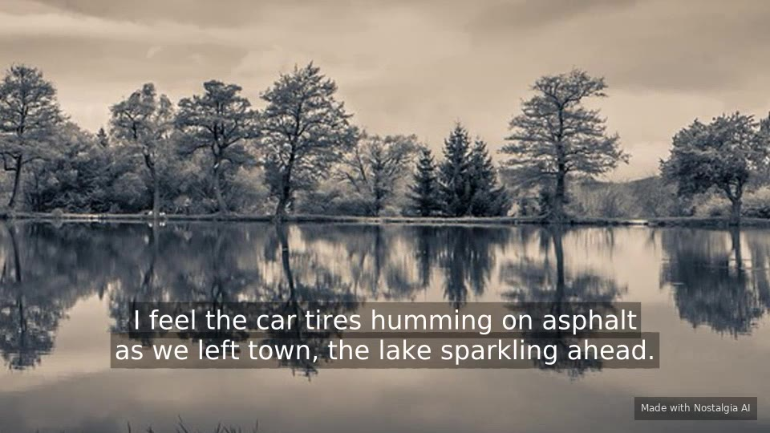
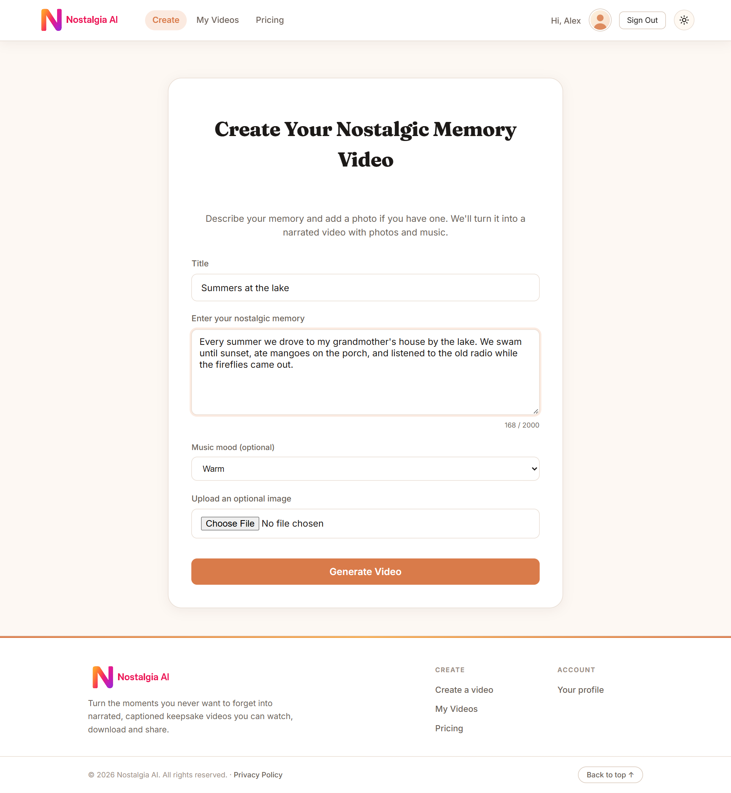
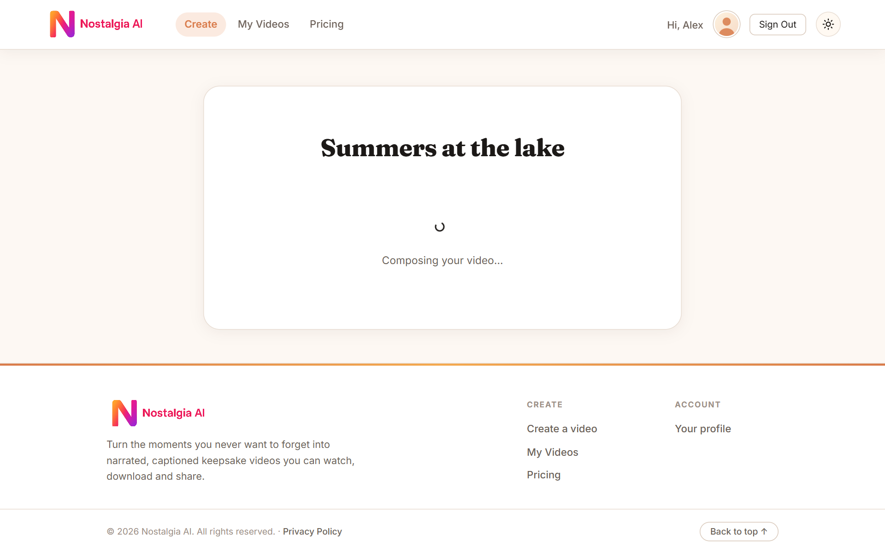
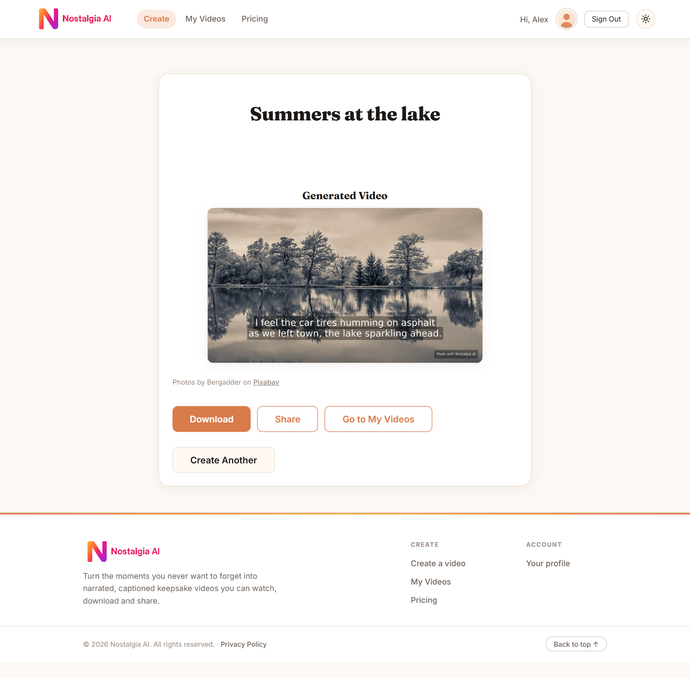
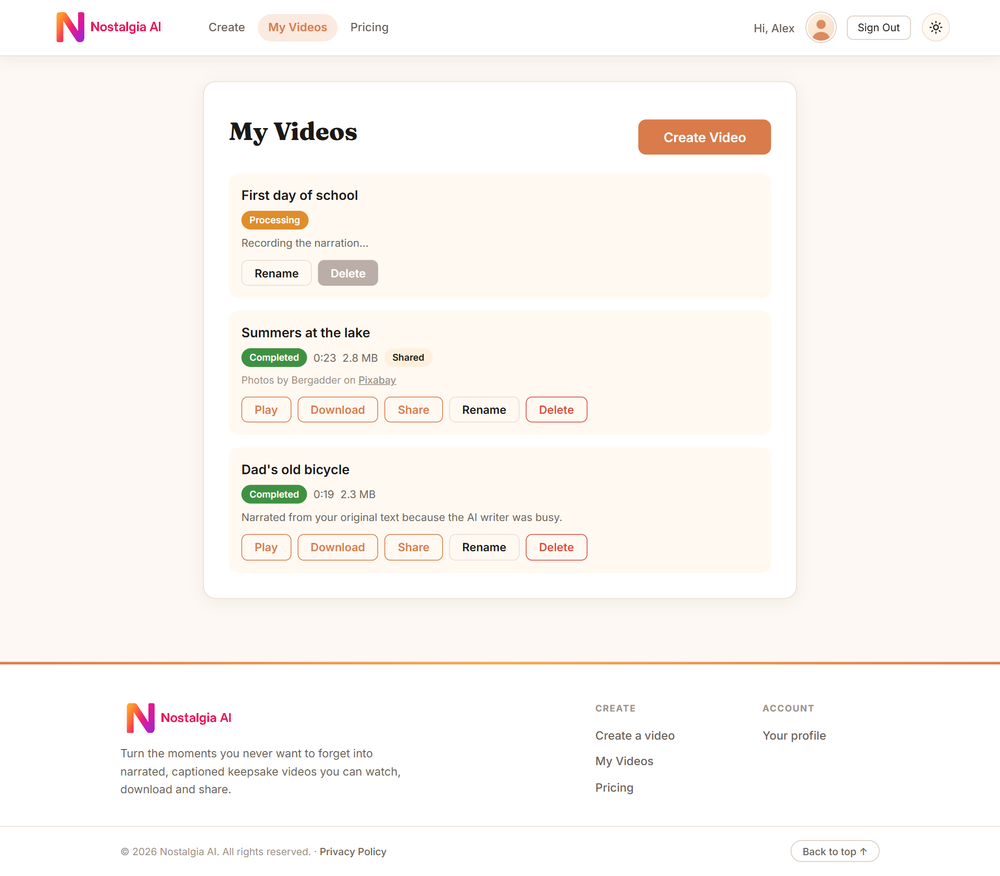
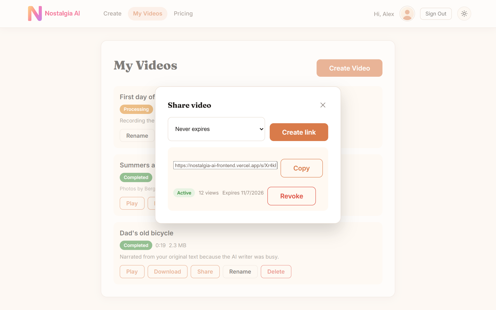
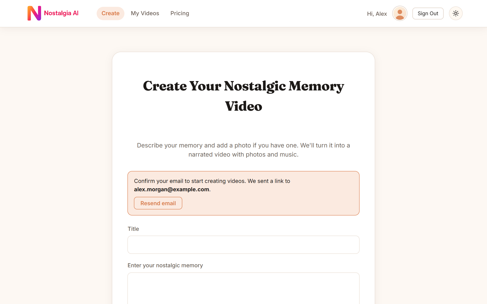
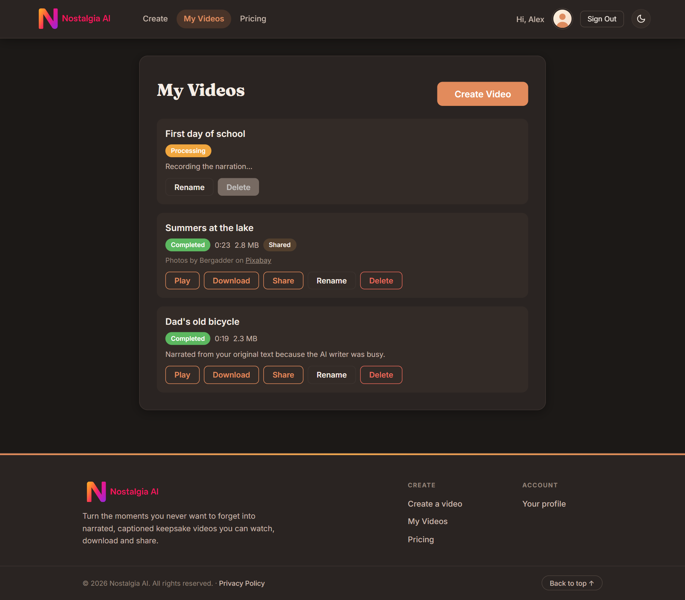
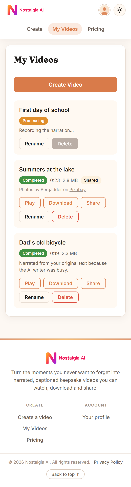

# Nostalgia AI — Frontend

React single-page app for Nostalgia AI: describe a memory, optionally add a photo, and the
service turns it into a narrated, captioned video with matching photos and music that you can
preview, download, and share by link.

**Live app:** https://nostalgia-ai-frontend.vercel.app
**API:** https://nostalgia-ai-backend.onrender.com ([backend repo](https://github.com/PawanLaksahanOfficial/nostalgia-ai-backend))

<p align="center">
  
  <br>
  <sub>A frame from a real render: AI-written narration as captions over a stock photo (Bergadder on Pixabay).</sub>
</p>

---

## Screenshots

| Describe a memory | Follow each step |
| --- | --- |
|  |  |
| **Watch the result** | **My Videos** |
|  |  |
| **Share by link** | **Email confirmation** |
|  |  |
| **Dark theme** | **On a phone** |
|  |  |

<sub>Screenshots use a demo account; the video is a real render.</sub>

---

## Features

- **Create a memory video** from a title, a story (20–2,000 characters), an optional music mood
  and an optional photo.
- **Live progress:** the page polls the API and shows each step ("Writing your story…",
  "Composing your video…") until the video is ready, then plays it inline.
- **Honest credits:** photographers are credited with a link to the photo site, and a note
  appears when the AI was unavailable and the story was narrated as written.
- **My Videos:** play, download, rename, delete and share; videos still being made update live.
- **Share links** with optional expiry, view counts and revocation, plus a public watch page
  that needs no account.
- **Sign-in** with email and password, Google, or Meta. New email accounts confirm their address
  before creating videos, with a banner and a resend button.
- **Plans and quota** from the API, with Stripe Checkout for Premium.
- **Light and dark themes**, and a layout that works down to phone width.

---

## Tech stack

| Concern | Choice |
| --- | --- |
| Framework | React 19 + TypeScript |
| Build tool | Vite 7 |
| Routing | react-router-dom 7 |
| State | Redux Toolkit + react-redux |
| HTTP | axios (with auth + 401 interceptors) |
| Styling | Inline style dictionary + CSS custom properties |
| Responsive | react-responsive + react-merge |
| Auth providers | Google (`@react-oauth/google`), Meta (`react-facebook`) |
| Testing | Vitest + Testing Library + jsdom |
| SVG | vite-plugin-svgr (`?react` imports) |

---

## Getting started

**Prerequisites:** Node.js 20+ and npm.

```bash
npm install
cp .env.example .env    # then fill in the values below
npm run dev             # http://localhost:3000
```

### Environment variables

All variables are read at **build time** and inlined into the bundle, so they are public by
definition — never put a secret in one.

| Variable | Purpose |
| --- | --- |
| `VITE_API_BASE_URL` | Backend origin, no trailing slash (e.g. `https://nostalgia-ai-backend.onrender.com`) |
| `VITE_GOOGLE_CLIENT_ID` | Google OAuth client ID for social sign-in. Must match the backend's `GoogleClientId`, and the site origin must be an Authorized JavaScript origin on that client |
| `VITE_META_APP_ID` | Meta app ID for social sign-in |
| `VITE_SUPPORT_EMAIL` | Contact address shown on the `/privacy` page (kept out of the repo on purpose) |

Each social button is hidden when its variable is empty. On Vercel, set them under
**Settings → Environment Variables** and **redeploy**: a build made before they were set keeps
the empty values. `vercel.json` rewrites every path to `index.html` so deep links and page
refreshes (e.g. `/register`) load the app instead of a 404.

### Scripts

| Command | What it does |
| --- | --- |
| `npm run dev` | Vite dev server with HMR |
| `npm run build` | Type-check (`tsc -b`) then production build to `dist/` |
| `npm run preview` | Serve the production build locally |
| `npm test` | Run the Vitest suite once |
| `npm run test:watch` | Vitest in watch mode |
| `npm run lint` | ESLint over the repo |

---

## Project structure

```
src/
  pages/                  Route-level screens (Home, Videos, Watch, Profile, Pricing, Privacy)
  components/
    common/               Button, InputField, TextArea, Modal, Header, Footer, toasts, errors
    videos/               VideoCard, ShareModal, VideoCredits
    userAuthenticate/     Login, Register, VerifyEmail, ForgotPassword, ResetPassword, social sign-in
    Svg/                  SVGs imported as React components
  services/               API layer (apiClient, userServices, videoServices)
  redux/                  Store and slices (auth, style, toast)
  hooks/                  useComponentStyle, useTheme, useToast
  models/                 Shared TypeScript types
styles/                   Per-component style objects + styleDictionary registry
docs/                     Images used in this README
```

### Styling system

Styling does not use CSS modules or a UI library. Each component has a matching file in
`styles/` exporting `{ mobile, desktop }` style objects, registered in
[`styles/styleDictionary.ts`](styles/styleDictionary.ts). Components read them via:

```tsx
const Styles = useComponentStyle("inputField");
```

On mobile the `mobile` object is returned as-is; on desktop `desktop` is merged over `mobile`,
so desktop only needs to declare overrides. Colors come from CSS custom properties
(`var(--color-bg-card)`, `var(--color-text-primary)`, …) so light/dark theming works without
touching the style objects. `Button` takes `size="small"` for rows of actions, such as the
buttons on a video card.

> **When adding a component:** create its style file, register it in `styleDictionary.ts`, and
> make sure every key the component reads actually exists. A missing key yields `undefined`,
> and reading a nested property off it throws at render time.

### API layer

[`src/services/apiClient.ts`](src/services/apiClient.ts) exports two axios instances:

- **`apiClient`** — attaches the JWT from `localStorage` to every request, and on a `401`
  from a non-auth endpoint clears the session and redirects to `/signIn?expired=1`.
- **`publicApiClient`** — no auth header and no redirect, used for public share links so an
  anonymous viewer is never bounced to sign-in.

Service functions turn failed responses into an `Error` carrying the server's message (via
`extractApiMessage`), so validation, quota and rate-limit replies reach the user as written.

### Creating a video

[`HomePage`](src/pages/HomePage.tsx) posts the form, then runs one self-rescheduling polling
loop per video: 2-second checks at first, then every 5 seconds, for up to 5 minutes. The loop
must not depend on the status changing to continue, because most checks return the same status
as the last one. When the video completes, it is fetched as a blob and played inline.

---

## Routes

| Path | Screen | Access |
| --- | --- | --- |
| `/` | Create a memory video | Public (prompts sign-in to generate) |
| `/pricing` | Plans and checkout | Public |
| `/signIn`, `/register` | Authentication | Public (redirects if signed in) |
| `/verify-email` | Confirms an email address from the emailed link | Public |
| `/forgot-password`, `/reset-password` | Password recovery | Public |
| `/videos` | My videos | Authenticated |
| `/profile` | Profile, quota, billing | Authenticated |
| `/privacy` | Privacy policy | Public |
| `/s/:token` | Public watch page for a shared link | Public |

---

## Deployment (Vercel)

Build command `npm run build`, output directory `dist`. Set the `VITE_*` variables in the
Vercel project settings — they are baked in at build time, so **changing one requires a
redeploy**.

### Required: SPA rewrite

This is a client-side-routed SPA. Without a rewrite, Vercel looks for a real file at each path
and returns **404 for every route except `/`** — breaking share links, emailed links, and
Stripe's post-checkout redirect. Add `vercel.json` at the repo root:

```json
{
  "rewrites": [{ "source": "/(.*)", "destination": "/index.html" }]
}
```

The backend's `Frontend:BaseUrl` must match the deployed origin, since it builds share URLs
(`/s/{token}`), email confirmation links (`/verify-email?token=…`) and reset links
(`/reset-password?token=…`) against it.

---

## Testing

```bash
npm test
```

Vitest with jsdom and Testing Library; setup lives in `src/test/setup.ts`. Tests sit next to
the code they cover. For example, [`HomePage.test.tsx`](src/pages/HomePage.test.tsx) drives the
status polling with fake timers under `StrictMode`, and
[`VerifyEmail.test.tsx`](src/components/userAuthenticate/VerifyEmail.test.tsx) checks that a
single-use link is sent only once. Components that call `useComponentStyle` read from the Redux
store, so render them inside a `<Provider>` — see
[`InputField.test.tsx`](src/components/common/InputField.test.tsx).
